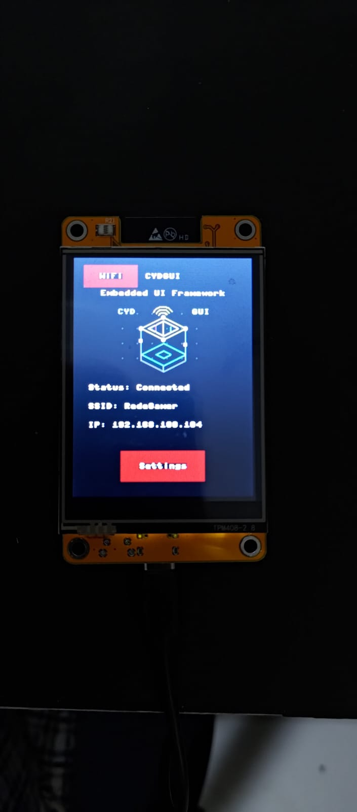

# micropython-cydgui

A lightweight GUI framework for MicroPython running on the **Cheap Yellow Display (CYD)** — ESP32 board with ILI9341 touchscreen.


## Overview

`cydgui` provides a simple, view-based UI model for building multi-screen applications on constrained hardware:

- **App** — manages routing and the main loop
- **View** — a screen; add widgets in `build()`
- **Widgets** — `Label`, `Button`, `Gauge`, `TextBox`, `VirtualKeyboard`, `Switch`, `Checkbox`, `ProgressBar`, `Canvas`, `Image`, `Panel`
- **Layouts** — `Row`, `Column`, `Grid`
- **Async support** — compatible with `uasyncio`

## Requirements

- ESP32 CYD board (ILI9341 display + XPT2046 touch)
- MicroPython firmware

## Basic Example

The example below shows a two-screen app with a gauge, navigation, and a virtual keyboard.

**`main.py`**
```python
from cydgui.driver import CYD
from cydgui.render.ili9341_renderer import ILI9341Renderer
from cydgui.app import App

from app_views.home import HomeView
from app_views.settings import SettingsView

cyd = CYD()
renderer = ILI9341Renderer(cyd.display)

app = App(renderer=renderer, touch=cyd.touch)

app.route("home", HomeView)
app.route("settings", SettingsView)

app.navigate("home")
app.run()
```

**`app_views/home.py`**
```python
from cydgui.core.view import View
from cydgui.widgets.label import Label
from cydgui.widgets.button import Button
from cydgui.widgets.gauge import Gauge
import uasyncio as asyncio

class HomeView(View):

    def __init__(self, app):
        self.app = app
        super().__init__("home")

    def build(self):
        self.add(Label(x=0, y=40, width=240, height=20, text="HOME SCREEN", align=Label.CENTER))

        self.gauge = Gauge(x=60, y=80, radius=50, min_value=0, max_value=100, value=50)
        self.add(self.gauge)

        self.add(Button(x=60, y=180, width=120, height=40, text="Gauge + Async", on_press=self.on_gauge_async))
        self.add(Button(x=60, y=240, width=120, height=40, text="Settings", on_press=self.on_settings))

    def on_settings(self, button):
        self.navigate("settings")

    def on_gauge_async(self, button):
        asyncio.create_task(self.gauge.set_value_async(75))
```

See [example/sample_app](example/sample_app) for the full working example including the Settings screen with a virtual keyboard.

## Screen App Sample





## `cydgui.widgets.canvas`

An optimized, memory-efficient **Immediate Mode** drawing canvas widget designed specifically for MicroPython and low-power hardware like the Cheap Yellow Display (CYD / ESP32).

## Features

* **Zero-RAM Drawing State:** Eliminates internal command lists or retained drawing tuples. Primitives are written directly to the screen hardware.
* **Garbage Collector Friendly:** Avoids runtime memory allocations during drawing loops to guarantee smooth performance and eliminate stuttering.
* **Container Tree Symmetrical:** Integrates seamlessly into the `cydgui` hierarchy, relying on the parent container to safely inject the hardware renderer at the correct frame cycle.
* **Dual-Purpose Architecture:** Operates both as a passive image/vector renderer or as an interactive touch-enabled widget.

---

## Technical Specifications & API

### Constructor

```python
Canvas(
    x: int = 0,
    y: int = 0,
    width: int = 100,
    height: int = 100,
    bg: int = 0x0000,
    border_color: int | None = None,
    touchable: bool = False,
    on_touch = None,
    on_draw = None
)

```

* `touchable`: Set to `True` to listen to interactive touch system inputs.
* `on_touch`: Callback routine triggered on safe bounding box intersection coordinates.
* `on_draw`: Callback reference mapping a custom user drawing loop code block.

### Local Drawing Primitives

> **Note:** All primitive operations map local layout pixel integers ($x$, $y$) automatically onto hardware absolute coordinates inside the viewport tree.

* `draw_pixel(x, y, color)`
* `draw_line(x1, y1, x2, y2, color)`
* `draw_rect(x, y, w, h, color, filled=False)`
* `draw_circle(x, y, r, color, filled=False)`
* `draw_text(x, y, text, color=0xFFFF)`
* `draw_arc(cx, cy, radius, start_angle, end_angle, color, step=6)`

---

## Basic Usage

### Scenario A: Passive Layout Vector Image / Static Logo

To bind a high-density primitive graphic layout without bloating RAM overhead, supply a drawing callback structure during initialization:

```python
from cydgui.widgets.canvas import Canvas

# 1. Define the isolated visual drawing routine
def draw_custom_graphic(canvas):
    # Palette definition (RGB565)
    CYAN = 0x07FF
    YELLOW = 0xFFE0
    
    # Render drawing steps directly to the viewport
    canvas.draw_line(0, 0, 100, 50, CYAN)
    canvas.draw_circle(50, 25, 10, YELLOW, filled=True)
    canvas.draw_text(10, 60, "STATIC RENDER")

# 2. Instantiate within a standard View block
canvas_logo = Canvas(
    x=50,
    y=50,
    width=120,
    height=80,
    bg=0x0000,
    touchable=False,         # Passive rendering mode
    on_draw=draw_custom_graphic
)

self.add(canvas_logo)

```

### Scenario B: Interactive Touch Surface

To implement interactive triggers such as customizable slider regions or touch coordinates detection:

```python
from cydgui.widgets.canvas import Canvas

# 1. Coordinate callback interface
def handle_touch_coordinates(event):
    print("User touched local canvas bounding box at:", event.x, event.y)

def draw_surface_background(canvas):
    # Renders a subtle inner crosshair
    canvas.draw_line(0, 25, 50, 25, 0x4208)
    canvas.draw_line(25, 0, 25, 50, 0x4208)

# 2. Setup interactive mode parameters
interactive_pad = Canvas(
    x=10,
    y=10,
    width=50,
    height=50,
    bg=0x1082,
    touchable=True,                 # Enable touch interception
    on_touch=handle_touch_coordinates,
    on_draw=draw_surface_background
)

self.add(interactive_pad)

```

---

## Lifecycle Controls

* **`clear()`:** Clears out the current `on_draw` visual routine hook and forces the target layout component viewport to drop back into a generic raw blank state (matching the `bg` color configuration).
* **`set_touchable(value: bool)`:** Toggles interactive input listener states programmatically during standard operational UI loops.


