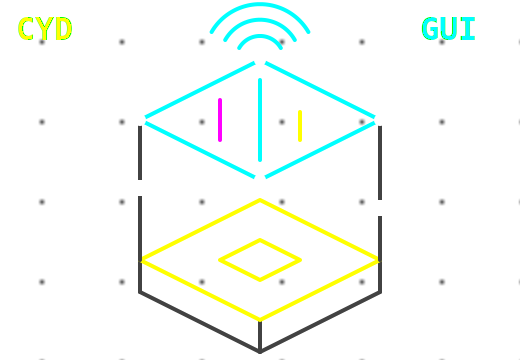
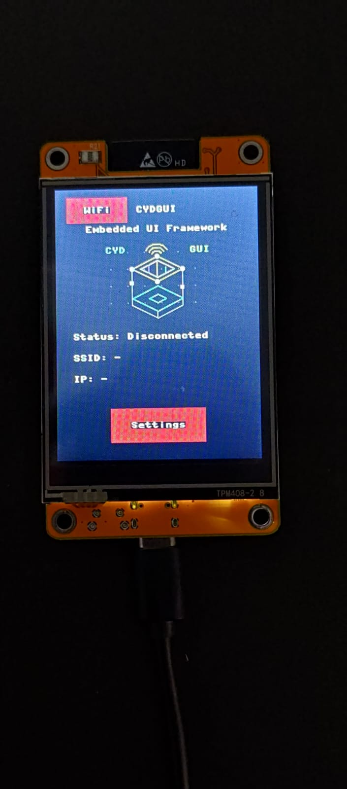
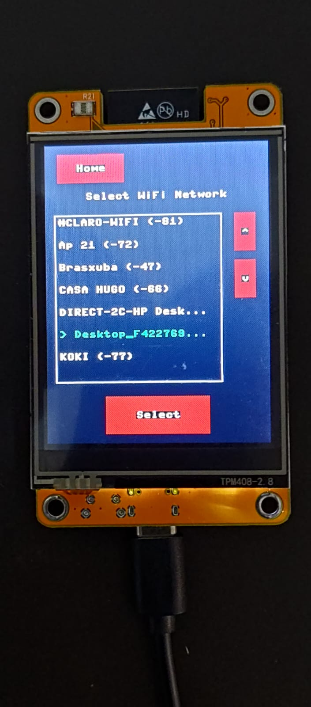
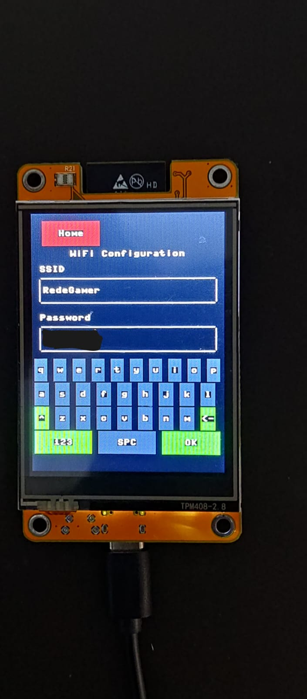
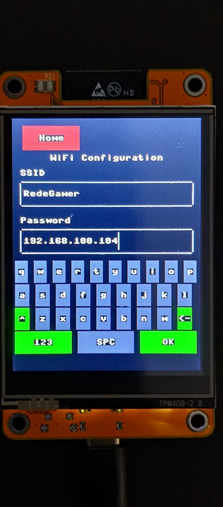

# micropython-cydgui

A lightweight GUI framework for MicroPython running on the **Cheap Yellow Display (CYD)** — ESP32 board with ILI9341 touchscreen.




## Overview

`cydgui` provides a simple, view-based UI model for building multi-screen applications on constrained hardware:

- **App** — manages routing and the main loop
- **View** — a screen; add widgets in `build()`
- **Widgets** — `Label`, `Button`, `Gauge`, `TextBox`, `VirtualKeyboard`, `Switch`, `Checkbox`, `ProgressBar`, `Canvas`, `Image`, `Panel`
- **Layouts** — `Row`, `Column`, `Grid`
- **Async support** — compatible with `uasyncio`

## Requirements

- ESP32 CYD board (ILI9341 display + XPT2046 touch)
- MicroPython firmware

## Basic Example

The example below shows a two-screen app with a gauge, navigation, and a virtual keyboard.

**`main.py`**
```python
from cydgui.driver import CYD
from cydgui.render.ili9341_renderer import ILI9341Renderer
from cydgui.app import App

from app_views.home import HomeView
from app_views.settings import SettingsView

cyd = CYD()
renderer = ILI9341Renderer(cyd.display)

app = App(renderer=renderer, touch=cyd.touch)

app.route("home", HomeView)
app.route("settings", SettingsView)

app.navigate("home")
app.run()
```

**`app_views/home.py`**
```python
from cydgui.core.view import View
from cydgui.widgets.label import Label
from cydgui.widgets.button import Button
from cydgui.widgets.gauge import Gauge
import uasyncio as asyncio

class HomeView(View):

    def __init__(self, app):
        self.app = app
        super().__init__("home")

    def build(self):
        self.add(Label(x=0, y=40, width=240, height=20, text="HOME SCREEN", align=Label.CENTER))

        self.gauge = Gauge(x=60, y=80, radius=50, min_value=0, max_value=100, value=50)
        self.add(self.gauge)

        self.add(Button(x=60, y=180, width=120, height=40, text="Gauge + Async", on_press=self.on_gauge_async))
        self.add(Button(x=60, y=240, width=120, height=40, text="Settings", on_press=self.on_settings))

    def on_settings(self, button):
        self.navigate("settings")

    def on_gauge_async(self, button):
        asyncio.create_task(self.gauge.set_value_async(75))
```

See [example/sample_app](example/sample_app) for the full working example including the Settings screen with a virtual keyboard.

## Screen App Sample









